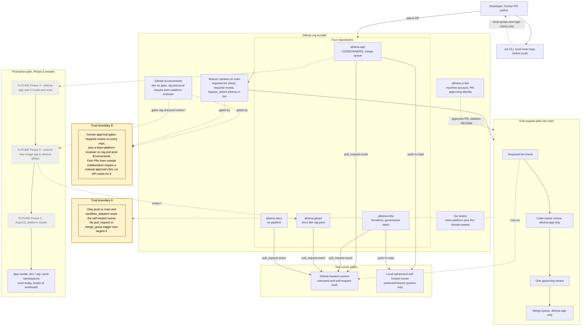

# CI/CD Topology

The control-flow picture: how a change moves from a developer's machine
through review, CI, and (from Phase 3) into a running cluster — and, just
as importantly, which trigger paths can and cannot reach the self-hosted
runner. A CI topology diagram that doesn't show its trust boundaries is
decoration; this one names them explicitly.

## Promotion path status

The promotion path drawn above (real CI build/scan on `athena-app`, the
commit into `athena-gitops`, and ArgoCD) is marked future/Phase 3 in full,
not just the ArgoCD box — `athena-app`'s current `lint.yml` is an explicit
placeholder Phase 3 replaces (see `athena-app` ADR-0001), and no automated
gitops-commit step exists yet. The one piece of this path that is real
today is the destination: `athena-app` cluster's `dev`/`stg`/`prod`
namespaces exist and are verified (`scripts/verify-clusters.sh`), just
empty of any Athena workload until Phase 3 lands them. Drawing the whole
pipeline as already-real would have overstated this phase's actual state —
the prohibition this diagram's threat model exists to prevent.

## Trust boundaries, named explicitly

**Boundary A — which trigger paths can reach the self-hosted runner.**
Only a push to `main` (post-merge) or a manual `workflow_dispatch` ever
places a job on the local self-hosted runner
(`athena-infra/.github/workflows/heavy-selfhosted.yml`). No workflow in
this estate carries a `pull_request` or `merge_group` trigger that targets
it — verified mechanically by `scripts/verify-runner.sh` and reinforced by
a redundant job-level `if github.ref == 'refs/heads/main'` condition. This
is what makes it safe to run a self-hosted runner, with root-equivalent
Docker access, against a public repository on a personal workstation — see
`athena-infra` ADR-0005 for the full blast-radius reasoning and its four
compensating controls.

**Boundary B — where the human approval gates sit.** Every repository
requires one approving review and a passing `lint` check before merge;
`athena-app` additionally requires code-owner review and a green merge
queue run. `stg` and `prod` GitHub Environments on `athena-app` and
`athena-gitops` require a `team-platform` reviewer before the
promotion-commit job that writes to those folders can run — the gate binds
to that job, not to ArgoCD, whose auto-sync stays on everywhere so the
Phase 3 drift-revert demonstration keeps working (see `athena-gitops`
ADR-0001). One control has no API surface at all and remains a standing
manual step: "require approval for all outside collaborators" on fork PRs,
set once per repo in each repo's Settings, reported as `MANUAL` (not a
fabricated pass) by `scripts/verify-governance.sh`.

## Runner identity, proven live

`athena-ci-bot` is the PR-approving identity for every repository (see
`athena-docs` ADR-0005 for why it's a user account and not a GitHub App).
On repositories without code-owner review (`athena-infra`, `athena-gitops`,
`athena-docs`), the bot's own approval satisfies the required-review check
directly. On `athena-app`, where code-owner review is also required, the
bot is not itself a CODEOWNERS team member, so its approval alone does not
satisfy that specific sub-requirement — merges there complete via the
ruleset's `bypass_actors` grant instead. Both paths were walked with real
pull requests during Phase 1 (see `athena-infra` Plan 05's summary), not
assumed from the Terraform configuration alone.
